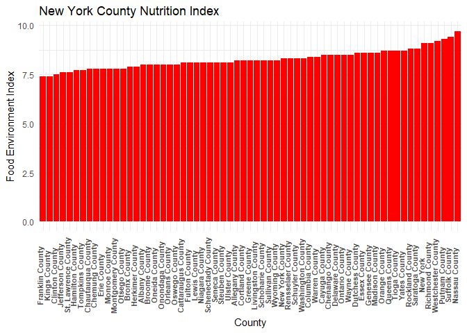
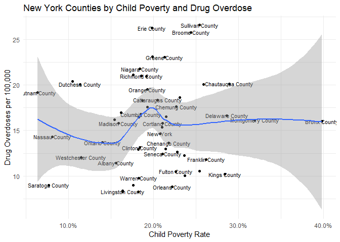
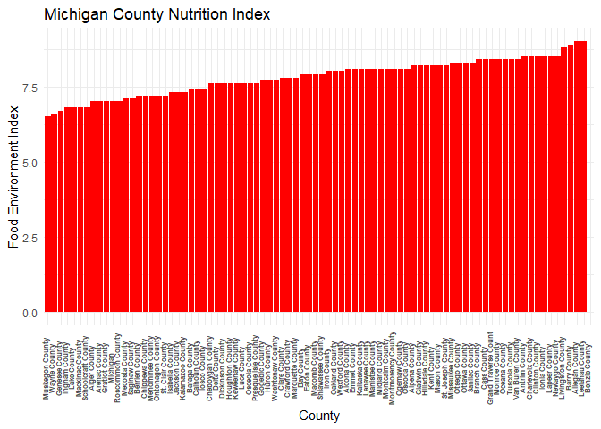
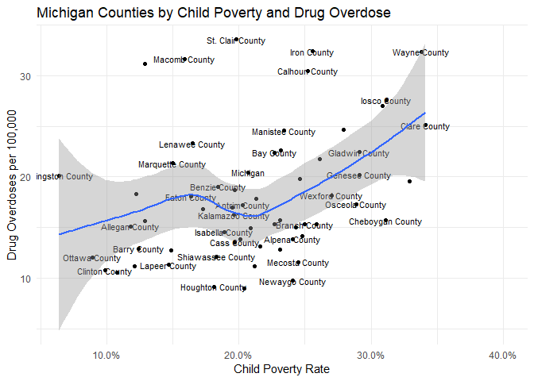
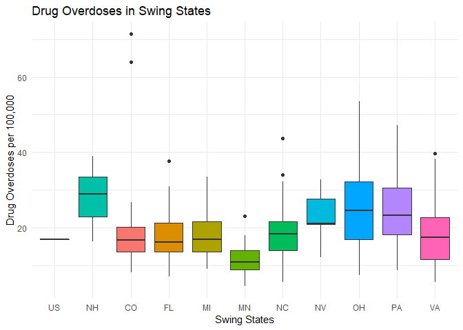
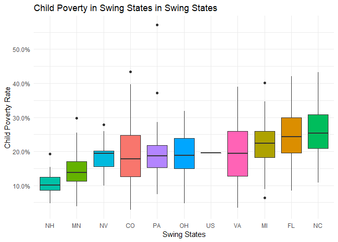

County Health Report
================
Gabriel Kahn
May 5, 2019

Introduction
============

This report is intended to be the first step in a larger project analyzing how health and economic factors influence US presidential elections. Here, I will use data collected from County Health Rankings and Roadmaps, an organization formed as a partnership between the Robert Wood Johnson Foundation and the University of Wisconsin Population Health Institute. The purpose here is exploratory; the hope is to gain a more nuanced look at the nation's health at a county level, with a particular focus on swing states. As the data set contains information for only one year, 2018, I cannot make time comparisons to get a sense of whether or not conditions are getting better or worse. Instead, I can compare states and counties to find pockets of areas which may be facing health crises. Looking ahead, I hope to collect data on election results by county to see if health factors relate to election outcomes.

Nutrition
=========

I would like to begin this health report by taking a broader state comparison across numerous health categories.

Statewide Nutrition Analysis
----------------------------

The County Health Rankings data set includes the Food Environment Index, a measurement broadly ranking a place's access to healthy food options. It takes into account several factors including income, proximity to grocery stores, and other measures which determine whether a population has access to healthy food options.

A population's nutrition levels can predict a wide variety of other health measures, from obesity rates to mental health, even premature death rates.

The above chart gives a broad ranking of states based on their nutrition level. It shows that there is a rather large disparity between Mississippi and even states in the middle of the distribution. Further questions are also raised as to why some states are so poor in this regard. Is it that most of the states at the bottom are warm whether states? Does being a largely rural state influence access to food? Perhaps it is also the case that there are county disparities within states; for example richer areas in New York may mask poor food indexes in other parts of the state.

Nonetheless, this chart will be helpful in future analysis, particularly when looking to see if swing states have similar characteristics when it comes to health.

County Nutrition Analysis
-------------------------

In order to see the variation within the states, we will perform the same operation, this time using the counties as the point of analysis.

### New York County Nutrition Analysis

While overall New York State has a high Nutrition Index at around 8.75, most counties fall short of this measure. Since the state mean is so much higher than the median county index, this hints that the counties whose values lie higher may have large populations which give them greater pull. Five counties have values higher than the mean, Nassau, Suffolk, Putnam, Westchester, and Richmond. Geographically, these counties closely border New York City, which may indicate higher levels of wealth.

### Social Ills by County

As New York is a large state with a large variety of county demographics. We saw from above that most of the counties fall below the state mean for the Food Environment Index. In the below graph, we look at the relationship between child poverty rates and drug overdose deaths by county. For clarity, overlapping values are removed. Drug overdoses are the number of deaths from overdose over a three-year period, per 100,000 people.

    ## Warning: Ignoring unknown parameters: label.padding

    ## `geom_smooth()` using method = 'loess' and formula 'y ~ x'

    ## Warning: Removed 8 rows containing non-finite values (stat_smooth).

    ## Warning: Removed 8 rows containing missing values (geom_point).

    ## Warning: Removed 8 rows containing missing values (geom_text).

Unsurprisingly the five counties with higher than mean Food Environment Indexes have low child poverty rates. What is more interesting is that drug overdose rates seem to be correlated with the counties in Upstate New York. Kings County (Brooklyn) and Bronx County have relatively low death rates when compared to more northern regions in the state. This may be due to the fact that Upstate New York is part of the Rust Belt.

Looking at the regression line, there is not the expected strong positive correlation between child poverty and drug deaths. This may be because of outliers such as Bronx County or it may be because other factors are driving the drug deaths other than poverty.

Michigan County Analysis
------------------------

For comparison, let's look at data from Michigan. Michigan is an interesting State for comparison. For one thing, like Upstate New York, it is part of the Rust Belt. Also, it is traditionally a "swing state" during presidential elections, therefore it is important to understand what is going on socially and economically.

### Michigan County Nutrition Index

    ## Warning: Removed 1 rows containing missing values (position_stack).

Michigan's Nutrition Index is distributed quite differently from New York's. Unlike New York, the mean score is significantly lower than the median county. This may be an indicator that the more populated areas of Michigan are socioeconomically worse off than the more populated areas of New York, which makes sense intuitively knowing the troubles Detroit has undergone in the past century.

### Michigan County Social Ills

    ## Warning: Ignoring unknown parameters: label.padding

    ## `geom_smooth()` using method = 'loess' and formula 'y ~ x'

    ## Warning: Removed 22 rows containing non-finite values (stat_smooth).

    ## Warning: Removed 22 rows containing missing values (geom_point).

    ## Warning: Removed 22 rows containing missing values (geom_text).

The distribution on this chart shows a strong correlation between poverty and drug deaths. The points are positioned generally higher than they are in the New York graph, although the counties in Upstate New York fall around where most of Michigan's points lie, showing a Rust Belt connection.

Social Factors in Swing States
==============================

Here we will take a look at these same social factors, but with a larger focus on swing states.

Drug Overdoses in Swing States Versus National Median
-----------------------------------------------------

    ## Warning: Removed 231 rows containing non-finite values (stat_boxplot).

From the above chart we that for all swing states, with the exception on Minnesota, the median county overdose rate lies near or above the national median. From the data it appears that Northeastern states, such as New Hampshire, Ohio, and Pennsylvania, have particularly high overdose rates. However, Colorado has the highest outliers.

Child Poverty in Swing States Versus National Median
----------------------------------------------------

Concerning child poverty, most of the states observed fall close to the national median, with New Hampshire significantly below. This is interesting because New Hampshire has both the lowest median childhood poverty rates and the highest median drug overdose rate. Also of interest is that although the median poverty rates are generally similar to the national level, the upper quartiles for many spread up to 10% higher.

Conclusion
==========

While not any sort of comprehensive analysis, this initial report is the beginning of what will hopefully be fruitful research. The code used to generate these graphs can be modified further to reveal more inner and outer state trends. Being that the dataset used has 508 variables, there is potential to find more meaningful relationships within the data.

As it stands currently, we have identified states which lag behind in proper nutrition. In the future, we will look to see if this deficiency shows up in other areas such as mental health or obesity rates. We have also shown how counties within states greatly differ in quality of life. With more nuanced information, we can better understand how populations within states do not neccessarily live under similar conditions.

Looking forward, I hope to unite this data set with electoral data and also to visualize it inside of an interactive map.

Meta Thoughts Regarding the Assignment
--------------------------------------

This assignment showed me the power of R and how far my abilities have come along this quarter. Searching for just the right data set took a while, but in my search I discovered just how much information there is available. It is quite amazing that by knowing R, I have the tools to analyze information in ways that I could not before.

I enjoyed the independence this homework afforded me as well. It feels good to be on my own to find data that interests me, and it feels even better to know that I can find random data online and make sense of it. There were several parts of the data which needed cleaning. Previously this would have taken me a while to do so, but now I understand better the different ways data is classified and also how to manipulate it into other forms.

I also learned the importance of finding credible data. There was another set of data which I wanted to use, and even uploaded, but upon further examination I was not sure if it was repudable enough.

The next step in my path is to find county voting data, and then to see if I can unite it with the set I used for this exercise.
